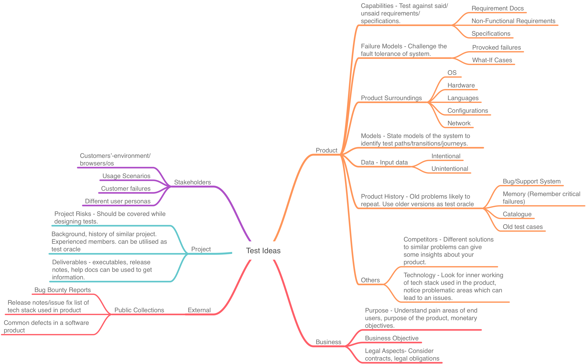
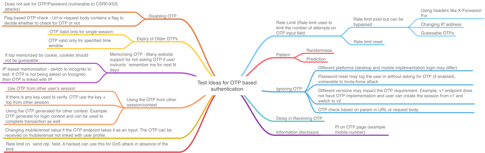

## Test Ideas

<blockquote class="twitter-tweet">
QA Engineer walks into a bar. Orders a beer. Orders 0 beers. Orders 999999999 beers. Orders a lizard. Orders -1 beers. Orders a sfdeljknesv.
&mdash; Bill Sempf (@sempf) <a href="https://twitter.com/sempf/status/514473420277694465?ref_src=twsrc%5Etfw">September 23, 2014</a></blockquote>  

#### Must Read
* [Test Heuristics Cheat Sheet](http://testobsessed.com/wp-content/uploads/2011/04/testheuristicscheatsheetv1.pdf)
* [Awesome list of Test Ideas](http://erik.brickarp.se/2016/08/how-to-come-up-with-test-ideas.html)

#### Other Useful Resources
* [Big list of Naughty Strings](https://github.com/minimaxir/big-list-of-naughty-strings/blob/master/blns.txt)
* [QA walks into a Bar](https://www.sempf.net/post/On-Testing1)
* [HICCUPPSF - Test Oracle](https://www.developsense.com/blog/2010/05/transpection-transpected/)

## Regression Testing Ideas

#### Blogs
* [Things Could Get Worse:Ideas About Regression Testing](https://www.developsense.com/presentations/2013-05-STAREast-Regression.pdf)
* [RCRCRC - Regression Mnemonic](https://www.xmind.net/embed/q3gr/)

## 2FA/OTP Testing Ideas
